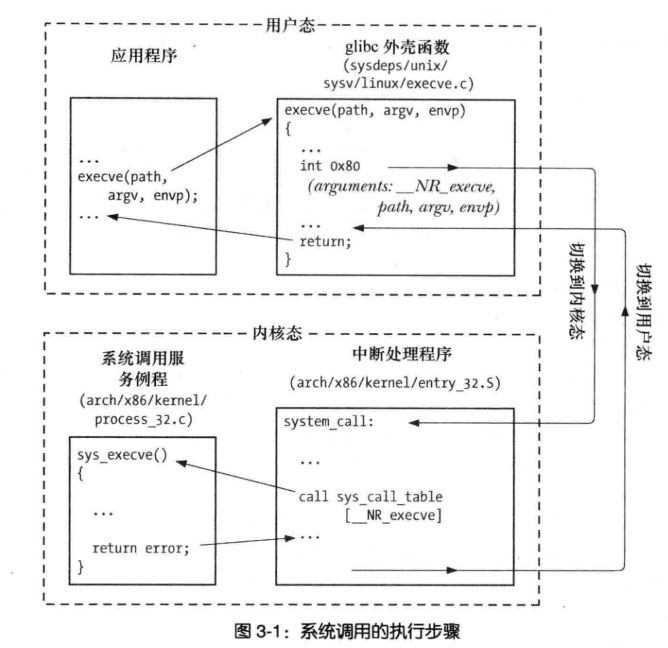

# 1. 系统调用
## 1.1 基本概念
- 作用: 进程可请求内核以自己名义通过 API 形式执行某些动作, 访问内核空间
- 特点: 用户态->核心态, 组成固定(数字标识各个系统调用), 可传额外参数
- 用法: 对于任何库函数或系统调用都要检测返回值确定调用是否成功
- 库函数: 基于系统调用之上, 方便用户使用的函数

## 1.2 系统调用过程(x86-32)
- 调用 C语言 外壳函数
  - 确保系统调用参数有效
  - 将参数复制到指定寄存器
  - 将系统调用编号复制到 %eax 中
  - 执行中断机器指令(0x80), CPU 切换为核心态, 执行 0x80 所指中断代码(arch/i386/entry.S)
- 内核响应中断, 调用 system_call 例程
  - 在内核栈中保存寄存器值
  - 审核系统调用编号的有效性
  - 根据编号在内核变量 sys_call_table 中找到对应调用服务例程, 检测参数有效性
  - 执行调用服务例程(.c), 返回结果状态给 system_call, 如果调用错误, 例程会对相应 errno 取反, 返回负值, 调用成功则返回非负值
  - 在内核栈中恢复寄存器值, 将返回值置于栈中
- 返回到外壳函数, CPU 已切换为用户态, 若出错则对返回值再次取反后设置为 errno, 外壳函数返回负数 -1 整数值



## 1.3 其他总结
- sysenter 指令替换 int 0x80 后进入内核的速度更快
- 系统调用例程出错会返回负值, 对 errno 取反, 外壳函数会对 errno 再次取反, 然后返回 -1, 这个惯例存在少数例外如 fcntl
- 系统调用存在开销 
- 可通过 strace 命令跟踪系统调用

# 2. 获取 glibc 版本
- `__GLIBC__.__GLIBC_MINOR__`(#get_libc_version.cc)
- gnu_get_libc_version       (#get_libc_version.cc)
- confstr                    (#confstr.cc)
- 通过 ldd 分析库获取
```bash
$ ldd copy         # 分析调用的共享库
$ /lib64/lib.so.6  # 显示 glibc 版本信息
```

# 3. 处理错误
## 3.1 处理系统调用错误
- 全局变量 errno 的部分值定义在 <cerrno> 内
- 系统调用失败, 会将 errno 置为正数
- 系统调用成功, 不会将 errno 置为 0 (SUSv3规定可以将 errno 设置为非零值)
- 系统调用成功, 有的会返回负值作为正确值
```c++
auto old_errno = errno; // 记录 errno
errno = 0;              // 重置 errno, 应对 成功返回负值的系统调用
auto fd = xxxx();
if (fd == M_SUCCESS) {  // 先判断调用成功再对错误进行处理
  ...
  errno = old_errno;    // 注意恢复原先的 errno
} else {
  if (errno = EXXX1) {
    
  }
  if (errno = EXXX2) {
    
  }
}
```

## 3.2 打印错误
- perror   (#print_error.cc)
- strerror (#print_error.cc)

## 3.3 处理库函数调用错误
- 与系统调用类似, 返回 -1, 设置 errno
- 返回其他值, 设置 errno
- 不使用 errno

# 4. 头文件
## 4.1 常用头文件
- 头文件 (#tlpi_hdr.h)
- C 语言可变参数列表 (#stdarg_test.cc)
```c
#include <cstdarg>
// 注意, 参数传递过程中已经通过类型提升 如: float -> doubel, short -> int
double average(int num, ...) {
  double sum = 0.0;
  va_list var_arg;                // 声明 va_list
  va_start(var_arg, num);         // 给定参数个数开始遍历
  for (int i = 0; i < num; ++i) {
    sum += va_arg(var_arg, int);  // 获取指定类型参数
  }
  va_end(var_arg);
  return sum / num;
}
```

## 4.2 错误处理函数
- 错误处理函数 (#error_function.cc)
- 关于 errno 在线程中的优化
```c++
// void errExitEN(int errnum, const char *format, ...); 
// pthread_create() 成功会返回 0, 错误会返回错误号
// 线程程序会将 errno 定义为宏, 每次使用 errno 展开成返回左值的函数调用
// 因此存储返回值再做操作, 而非使用 errno 存储, 可减少对 errno 的访问
auto s = pthread_create(&thread, nullptr, func, &arg);
if (s != 0) {
  errExitEN(s, "pthread");
}
```

## 4.3 处理数值函数
- strtol (#my_strtol.cc)

# 5. 可移植性
- 测试性宏: 规定了系统调用和库函数的标准 `gcc -D_XOPEN_SOURCE=600`
- 系统数据类型类型: <sys/types.h> 定义
- 打印参数类型: 
  - long long / long: 使用 %lld / %ld 打印
  - size\_t / ssize\_t: 使用 %zd  
  - intmax_t/ uintmax_t: 使用 %jd
- 结构体字段顺序: 用 `struct s{ .field = 1, .field2 = 2};` 初始化, 防止顺序不一致
- 针对特殊宏做判断: `#fidef WCOREDUMP ...`
- 头文件变化问题: 通过系统信息宏使用不同的头文件