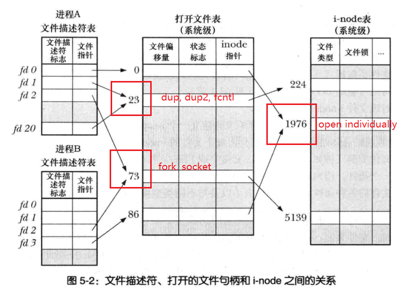

# 1. 原子操作
- 原子操作: 内核保证系统调用中所有步骤为独立操作一次执行, 不会被其他进程或线程中断
- 竞争状态: 操作共享资源的两个进程(或线程)运行的结果取决于调度的先后顺序 
- O_EXCL, O_APPEND: 确保文件打开是独占的, 确保偏移量移动和打开是原子的 (#bad_exclusive_open.cc)

# 2. fcntl
- 获取方式: F_GETFL, 注意 access_mode = flags & O_ACCMODE
- 修改方式: F_SETFL, 只允许改变部分状态位 O_APPEND, O_ASYNC, O_DIRECT, O_NOATIME,O_NONBLOCK (#t_fcntl.cc)

# 3. 文件描述符和文件
- 内核维护三个数据结构:
  - 文件描述符表(open file descriptor): 每个进程单独维护一个, 含有 close_on_exec 标志
  - 打开文件表(open file (description) table): 所有打开文件由系统统一维护
  - 打开文件句柄(open file handle): 打开文件表的条目, 含有访问模式, 信号驱动的I/O设置等属性
  - i-inode 表: 由文件系统维护, 含有文件类型, 指向锁表的指针, 文件属性等信息
- i-node 在内存和磁盘的区别: 前者复制了磁盘中的信息, 增加了打开文件句柄数量, 所在主从设备号和文件锁信息
- 文件描述符的性质: 共享偏移量, 状态位和访问模式, 不共享 close_on_exec 标志

# 4. 复制文件描述符
- dup, dup2, dup3 (#t_dup.cc)
- fcntl(F_DUPFD), fcntl(F_DUPFD_CLOEXEC)

# 5. 在特定偏移量处 I/O
- pread, pwrite, 要求目标文件可定位
- 优点: 原子性, 避免反复 lseek

# 6. 分散输入与集中输出
- readv, writev(#t_readv.cc)
- preadv, pwritev 在特定偏移量处进行操作
- 优点: 原子性, 一次性读取输出多个缓冲区
- 库函数的额外工作: 如果失败则会分配一个较大内存存放所有缓冲区后调用 write

# 7. 截断文件
- truncate, ftruncate (#t_truncate.cc)
- 若超出参数则截断, 若小于参数则增加文件空洞或空字节

# 8. 大文件 I/O
- 32 位机器字长的系统, long 和 off_t 为 32 位, 文件最大为 2^32-1
- LFS API(定义宏`_LARGEFILE64_SOURCE`): 调用 open64, lseek64, truncate64, stat64, mmap64, setrlimit64
- 宏`_FILE_OFFSET_BITS 64`: 自动将 open 等函数转为 open64, 将 off_t 转为 long long 类型
- 如果 open 调用 大于 2GB 以上文件会出错, 需要指定 O_LARGEFILE 标志